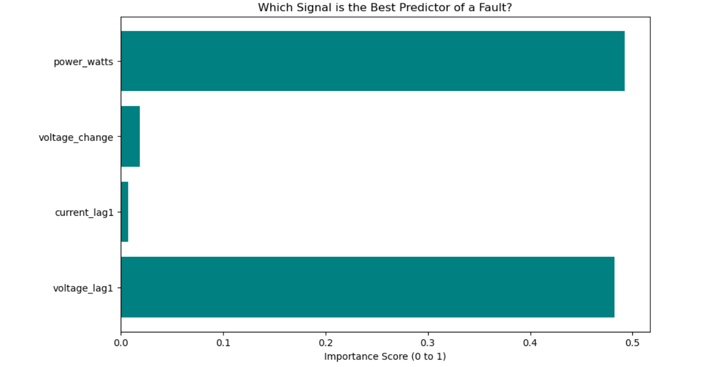

⚡ Smart Grid Monitoring & Predictive AI
An End-to-End IoT & Machine Learning Pipeline
 Project Overview
This project simulates a Smart Grid Substation monitoring system. It captures real-time sensor data (Voltage, Current, Frequency), stores it in a relational database, visualizes it for operators, and uses a Random Forest Machine Learning model to predict grid instabilities before they occur.

 The Tech Stack
Language: Python (Pandas, Scikit-Learn, SQLAlchemy)

Database: PostgreSQL

Visualization: Power BI

Machine Learning: Random Forest Classifier (with Balanced Class Weights)

 System Architecture
Data Generation: A Python-based simulator creates 24 hours of electrical sensor logs, including anomalies like Voltage Sags and Swells.

Database Layer: Data is streamed into a PostgreSQL database for permanent storage.

Analytics Dashboard: A Power BI dashboard connects to SQL to provide:

Synchronized Voltage & Current trends.

Real-time Anomaly KPI cards.

A filtered Fault Log for audit purposes.

Predictive AI: A Random Forest model analyzes historical "Lags" and Power (Watts) to predict faults.

Hybrid Alert System: A Python control script combines AI probability with a Safety Override threshold for 100% reliability.

📈 Key Findings
Feature Importance: Through training, the model identified Power (Watts) as the strongest predictor of grid instability, outperforming raw voltage readings.

Model Performance: By implementing class_weight='balanced', the model effectively identifies rare fault events in imbalanced datasets.

🚀 How to Run

Database Setup
Open pgAdmin and create a new database named smart_grid.

Ensure your connection string in the Jupyter Notebook (under the "Database Connection" cell) matches your local credentials (username/password).

 Execution
Open predictive_analysis.ipynb in Jupyter Notebook or VS Code.

Run the Simulation Cells: This will generate synthetic electrical data and stream it into your PostgreSQL smart_grid table.

Run the Training Cells: This trains the Random Forest Classifier and saves the smart_grid_model.pkl file.

Test the Alert System: Use the final cell to input "Live" voltage readings and trigger the Safety Override or AI Alert.

 Visualization
Open Smart_Grid_Dashboard.pbix.

Click Refresh to pull the latest data from your local PostgreSQL database.
